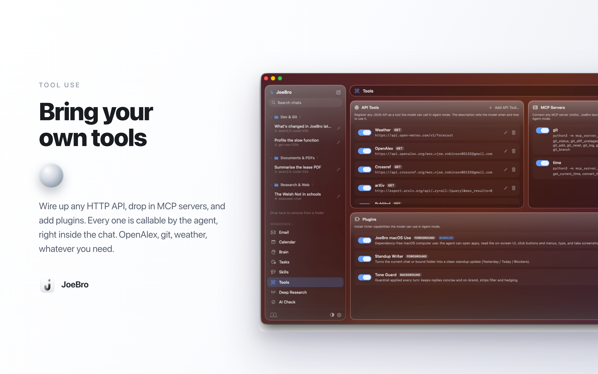

<p align="center">
  
</p>

<h1 align="center">JoeBro</h1>

<p align="center">
  A native macOS AI workspace that's actually yours.<br>
  Local-first. Private. Built to get things done.
</p>

---

## Why JoeBro exists

Most people never get the most out of AI. Not because they couldn't, but because:

1. **The good stuff is hidden behind a learning curve.** Agents, tools, local models, document editing, automations. Most people only ever see a chat box.
2. **Nobody has time to learn it.** Reading docs, wiring up APIs and writing prompts is a job in itself, and you already have one.
3. **Big tech overcharges for it and watches you while you use it.** Your work, your inbox, your calendar and your half-formed ideas all become training data and ad signal.

JoeBro is another way. It hands a busy person the full power of modern AI without asking them to become a software engineer, and it does it while keeping their data on their own machine. You bring your own models (run them locally or plug in any API key), and JoeBro turns them into a real assistant that knows your work, edits your documents, reads your email, manages your calendar, runs research, and remembers what matters. No platform tax, and nobody looking over your shoulder.

AI is better when it knows you, so keep it close, away from big tech.

**Read the technical breakdown** on why I built this with zero dependencies and no Electron [on Dev.to](https://dev.to/joexk1/why-i-built-a-native-macos-ai-workspace-with-zero-dependencies-1c2i)

---

## What it is

JoeBro is a native macOS app (SwiftUI) with a small backend bundled right inside it. The backend is plain Python standard library, spawned automatically when the app launches and talking to it locally over `http://127.0.0.1:8765`. There is nothing to install, no account to make, and nothing leaves your Mac unless you explicitly connect an external model or mailbox.

It's one window, not ten apps:

**Core**
- **Chat** with any model, with live streaming, extended thinking, and a real agent mode. Sort chats into folders to keep side projects away from work, or split things by topic. Just drag and drop.
- **Agent mode** that uses tools. It reads files, edits documents, runs the terminal, searches the web, calls your own APIs, and manages your calendar and email.
- **Deep Research** that reads many sources and writes a cited report.
- **Documents** opened right beside the conversation, including real Word `.doc` and `.docx` files, edited in place.


- **Theming**: an adaptive glass interface over any wallpaper you choose, with built-in colour accents to match your style.


**Workspace tools**, all local, self-improving, and manually manageable.
- **Email** over IMAP: read, compose, reply, forward, triage. All on your machine.
- **Calendar**: your events, add, edit and delete, all from within the app.
- **Brain**: long-term memory that persists across sessions and improves the more you use it. Add, edit, search, or delete memories manually anytime.


- **Skills**: JoeBro teaches itself the things you do often. Review, edit, or prune them by hand whenever you like.
- **AI Check**: paste text to see how AI-written it reads, with the suspect sentences flagged.

For a full walkthrough of every tab, control and right-click menu, see the **[User Guide](USER_GUIDE.md)**. To go from zero to your first message in under a minute, start with **[Getting Started](GETTING_STARTED.md)**.

---

## Tools: bring your own

The Tools tab has three tiers, all surfaced to the model in Agent mode as callable functions. This is where JoeBro stops being a chat box and starts being a workspace the agent can actually act in.



**API Tools** give any JSON endpoint straight to the model. You give it a URL, a name, a description, and optionally an API key and a method. Put `{query}` anywhere in the URL and the model's input gets dropped in right there. The description tells the model when to call it. A weather API gets called when someone asks about the weather. A HackerNews search when the topic is tech. It just works. Point it at any public database right in chat. LinkedIn, Crunchbase, GitHub, you name it. No curated list, anything with a URL works.

**MCP Servers** are the Model Context Protocol over stdio. The app launches the server, discovers its tools, and offers them to the model. The connection is stateless. Spawn, initialize, call, kill. No long-running processes. No zombie children. There is a hard wall clock timeout on every interaction so a broken server never hangs a turn. The git MCP server returns real diffs. The model calls it, the server spawns, it runs, it dies, the diff comes back.

**Plugins** are the third tier. They are folders on disk that can ship their own tools, memory, and agent logic. They can be foreground (active tools the model can invoke) or background (guardrails that shape every turn). The bundled one is the macOS Use plugin. Dependency free. It controls the Mac through `osascript` and `screencapture`. No node module, no Python package, no Docker image. It calls System Events directly and the model can use it to open apps, click buttons, and take screenshots.

The agent calls API tools, memory, tasks, calendar, and plugins in one conversation. It looks like any other chat.

---

## Message Bot (Telegram)

Run JoeBro from your phone. Connect a Telegram bot and message it from anywhere to drive your whole workspace. It searches and reads across all your chats, creates new ones, binds them to folders, sets their mode and permissions, and delegates work to them, then reports back. It also uses your email, calendar, memory, web search and deep research directly. It is an orchestrator, not a coder: it never edits files itself, it hands that to a chat.

Set it up in **Settings > Message Bot**: paste a bot token from Telegram's @BotFather, pick the model it should use, and add your numeric Telegram ID to the allow list (message the bot once and it tells you your ID). You choose what it shows in replies (skills, memories, tool calls, plugins) and whether it asks you to approve actions with a y/n reply. Commands: `/chats` lists your chats, `/compact` trims the conversation, `/help` shows what it can do.

Replies stream in live and render Markdown. Because the backend is bundled in the app, the bot is reachable whenever JoeBro is running on your Mac. Full walkthrough in the **[User Guide](USER_GUIDE.md)**.

---

## Local-first and private by design

- **Your data stays on your Mac.** Chats, memory, notes, tasks and documents live in a local SQLite store in `~/Library/Application Support/JoeBro/`.
- **Bring your own models.** Run local models with Ollama (or anything OpenAI-compatible) over your network, or paste an API key for DeepSeek, OpenAI, Anthropic, Groq, Gemini, OpenRouter and friends. You choose per message, and you can switch model mid-conversation without losing the thread.
- **No telemetry, no middleman.** The app talks to its own local backend and to whichever model endpoints you set up. Nothing else is in the loop.
- **You hold the keys.** API keys are stored locally. When the agent touches files or runs commands, you decide how much access it gets.

---

## Requirements

- **macOS 26 (Tahoe)** or later on Apple Silicon.
- **Xcode 26** or later to build it.
- **Python 3** (the system `python3` that ships with macOS is fine). The backend uses only the standard library, so there is nothing to `pip install`.

---

## Install (download)

Grab the latest **JoeBro.dmg** from the [Releases page](https://github.com/joexk1/joebro/releases), open it, and drag **JoeBro** into Applications.

**First launch, do this once.** JoeBro is a free indie app and isn't notarized by Apple, so macOS Gatekeeper blocks the *first* open. To get past it:

1. **Right-click** JoeBro in Applications, then **Open**.
2. In the warning dialog, click **Open** again. *(A normal double-click won't offer the Open button, so you have to right-click then Open.)*
3. Still blocked? Go to **System Settings → Privacy & Security**, scroll to the bottom, and click **Open Anyway** next to the JoeBro message, then reopen.

You only do this once. JoeBro updates itself from then on (**Settings → General → Check for Updates**, or automatically), and updates don't repeat the Gatekeeper step.

---

## Build and run

1. Open `JoeBro.xcodeproj` in Xcode.
2. Select the **JoeBro** scheme and a **My Mac** destination.
3. Press Run.

That's it. The Python backend is bundled in the app and launches with it. On first run, open **Settings** (the gear in the sidebar footer) and add a model endpoint so JoeBro has something to talk to. Optionally connect a mailbox over IMAP and your calendar (macOS Calendar or CalDAV).

---

## Project layout

```
JoeBro/
  JoeBroApp.swift              app entry, launches the bundled backend
  AppStore.swift               central @Observable state
  APIClient.swift              talks to the local backend
  *Panel.swift / *View.swift   the tabs and UI (Chat, Email, Calendar, Brain, Tools, ...)
  ToolsPanel.swift             the Tools tab: API tools, MCP servers, plugins
  EditorPane / EditorTextView  the document editor (Markdown + Word docs)
  Backend/                     the local server (stdlib Python, SQLite)
    joebro_backend.py          entry point: HTTP router + server bootstrap
    jb_core.py                 shared library: helpers, constants, the SQLite store
    jb_chat.py                 chat, the agent loop, streaming, compaction
    jb_tools.py                tool dispatch and execution: native calls, XML blocks, API tools, MCP, plugins, macOS use
    jb_assistant.py            memory, skills, tasks, deep research
    jb_email.py / jb_calendar.py / jb_docs.py    integrations
    jb_models.py               model discovery, API tools, MCP servers, plugins
    jb_files.py                workdir browsing and uploads
assets/                        logo and brand
GETTING_STARTED.md             60-second quickstart
USER_GUIDE.md                  full feature and right-click reference
```

The backend is still zero dependencies. It is not one file anymore though. It grew to the point where that stopped making sense, so it is split into small sibling modules: one entry point that holds the HTTP router, and feature mixins composed onto it. `jb_tools.py` routes every tool path in one place: native function calls, XML tool blocks, custom API tools, MCP servers, plugins, and macOS use. The MCP client is stateless, with a background reader thread so a hanging subprocess can never block a request, and a hard deadline on every server interaction. If a server does not reply in time, the process gets killed and reaped and the turn continues. Standard library only. No `pip install`. One Xcode project, one Build, and it runs.

---

## Contributing

Issues and pull requests are welcome. Keep changes focused and in the spirit of the project: simple, local-first, and genuinely useful to people who are not engineers.

See **[CONTRIBUTING.md](CONTRIBUTING.md)** for how to submit a PR, report bugs, and get in touch with me directly on GitHub at [@joexk1](https://github.com/joexk1).

---

## Inspiration

Huge thanks to **PewDiePie**, whose videos on running your own local AI and his workspace project **Odysseus** were the spark for this whole thing. The idea that anyone can own their AI, instead of renting a window into someone else's, and the vision of a real workspace, not just a chat box, came straight from there.
