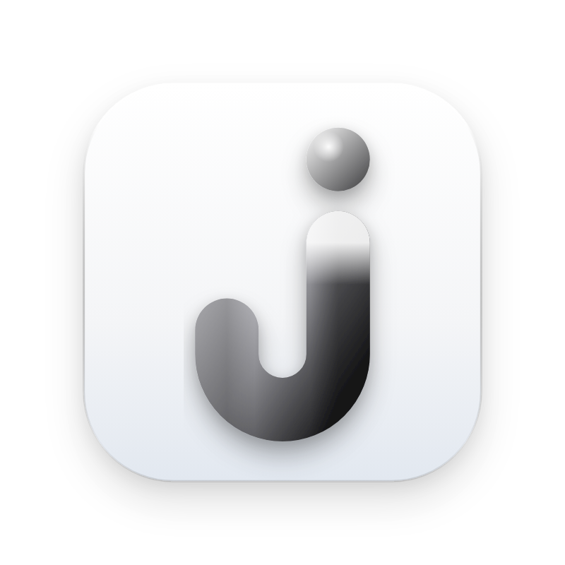
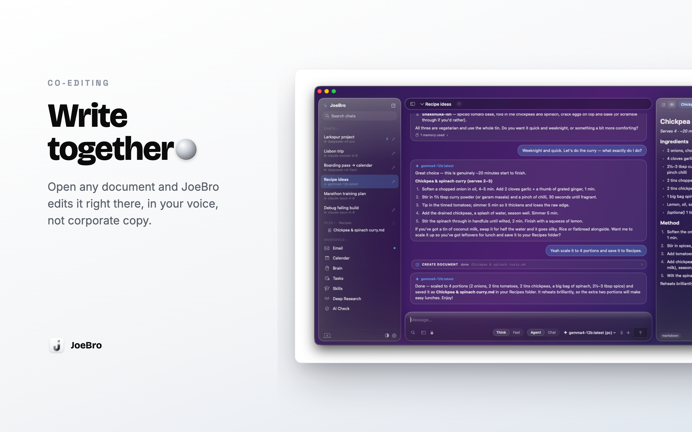
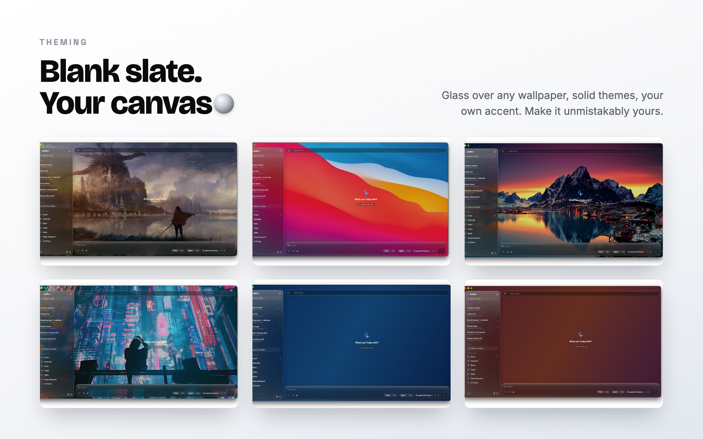
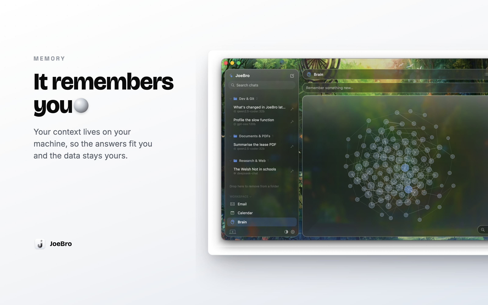

<p align="center">
  
</p>

<h1 align="center">JoeBro</h1>

<p align="center">
  A native macOS AI workspace that's actually yours.<br>
  Local-first. Private. Built to get things done.
</p>

---

## Why JoeBro exists

Most people never get the most out of AI. Not because they couldn't, but because:

1. **The good stuff is hidden behind a learning curve.** Agents, tools, local models, document editing, automations. Most people only ever see a chat box.
2. **Nobody has time to learn it.** Reading docs, wiring up APIs and writing prompts is a job in itself, and you already have one.
3. **Big tech overcharges for it and watches you while you use it.** Your work, your inbox, your calendar and your half-formed ideas all become training data and ad signal.

JoeBro is another way. It hands a busy person the full power of modern AI without asking them to become a software engineer, and it does it while keeping their data on their own machine. You bring your own models (run them locally or plug in any API key), and JoeBro turns them into a real assistant that knows your work, edits your documents, reads your email, manages your calendar, runs research, and remembers what matters. No platform tax, and nobody looking over your shoulder.

AI is better when it knows you, so keep it close, away from big tech.

---

## What it is

JoeBro is a native macOS app (SwiftUI) with a small backend bundled right inside it. The backend is plain Python standard library, spawned automatically when the app launches and talking to it locally over `http://127.0.0.1:8765`. There is nothing to install, no account to make, and nothing leaves your Mac unless you explicitly connect an external model or mailbox.

It's one window, not ten apps:

**Core**
- **Chat** with any model, with live streaming, extended thinking, and a real agent mode.
- **Agent mode** that uses tools. It reads files, edits documents, runs the terminal, searches the web, and manages your calendar and email.
- **Deep Research** that reads many sources and writes a cited report.
- **Documents** opened right beside the conversation, including real Word `.doc` and `.docx` files, edited in place.



- **Theming** — an adaptive glass interface over any wallpaper you choose, with built-in colour accents to match your style.



**Workspace tools** — all local, self-improving, and manually manageable.
- **Email** over IMAP — read, compose, reply, forward, triage. All on your machine.
- **Calendar** — your events, add/edit/delete, all from within the app.
- **Brain** — long-term memory that persists across sessions and improves the more you use it. Add, edit, search, or delete memories manually anytime.



- **Skills** — JoeBro teaches itself the things you do often. Review, edit, or prune them by hand whenever you like.
- **AI Check** — paste text to see how AI-written it reads, with the suspect sentences flagged.

For a full walkthrough of every tab, control and right-click menu, see the **[User Guide](USER_GUIDE.md)**. To go from zero to your first message in under a minute, start with **[Getting Started](GETTING_STARTED.md)**.

---

## Local-first and private by design

- **Your data stays on your Mac.** Chats, memory, notes, tasks and documents live in a local SQLite store in `~/Library/Application Support/JoeBro/`.
- **Bring your own models.** Run local models with Ollama (or anything OpenAI-compatible) over your network, or paste an API key for DeepSeek, OpenAI, Anthropic, Groq, Gemini, OpenRouter and friends. You choose per message, and you can switch model mid-conversation without losing the thread.
- **No telemetry, no middleman.** The app talks to its own local backend and to whichever model endpoints you set up. Nothing else is in the loop.
- **You hold the keys.** API keys are stored locally. When the agent touches files or runs commands, you decide how much access it gets.

---

## Requirements

- **macOS 26 (Tahoe)** or later on Apple Silicon.
- **Xcode 26** or later to build it.
- **Python 3** (the system `python3` that ships with macOS is fine). The backend uses only the standard library, so there is nothing to `pip install`.

---

## Build and run

1. Open `JoeBro.xcodeproj` in Xcode.
2. Select the **JoeBro** scheme and a **My Mac** destination.
3. Press Run.

That's it. The Python backend is bundled in the app and launches with it. On first run, open **Settings** (the gear in the sidebar footer) and add a model endpoint so JoeBro has something to talk to. Optionally connect a mailbox over IMAP and your calendar (macOS Calendar or CalDAV).

---

## Project layout

```
JoeBro/
  JoeBroApp.swift              app entry, launches the bundled backend
  AppStore.swift               central @Observable state
  APIClient.swift              talks to the local backend
  *Panel.swift / *View.swift   the tabs and UI (Chat, Email, Calendar, Brain, ...)
  EditorPane / EditorTextView  the document editor (Markdown + Word docs)
  Backend/joebro_backend.py    the local server (stdlib Python, SQLite)
assets/                        logo and brand
GETTING_STARTED.md             60-second quickstart
USER_GUIDE.md                  full feature and right-click reference
```

---

## Contributing

Issues and pull requests are welcome. Keep changes focused and in the spirit of the project: simple, local-first, and genuinely useful to people who are not engineers.

---

## Inspiration

Huge thanks to **PewDiePie**, whose videos on running your own local AI and his workspace project **Odysseus** were the spark for this whole thing. The idea that anyone can own their AI, instead of renting a window into someone else's, and the vision of a real workspace, not just a chat box, came straight from there.